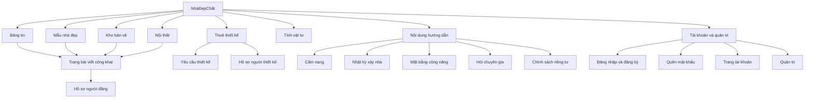
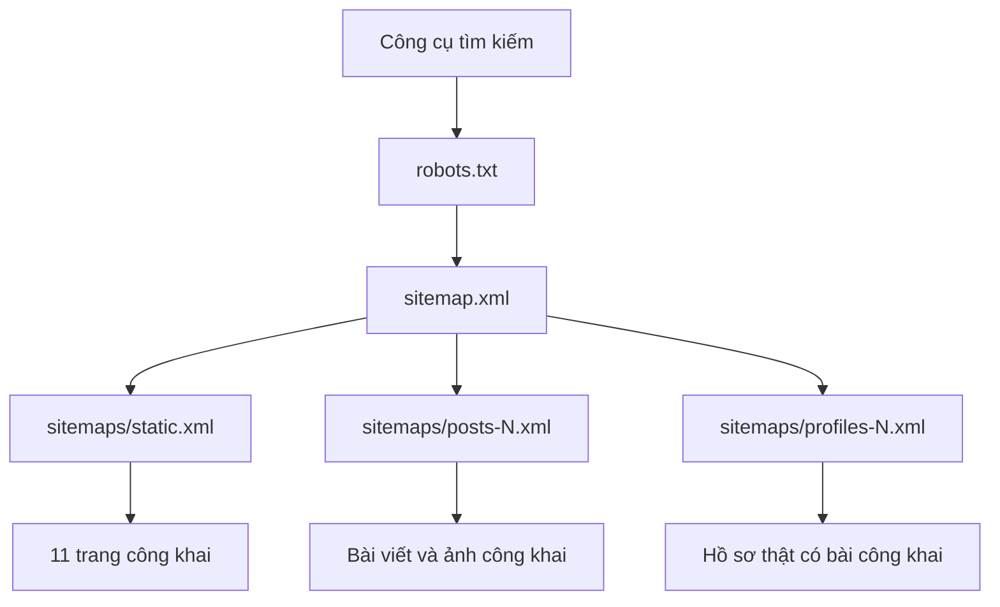
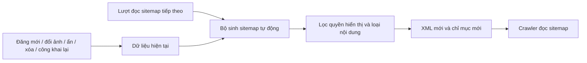

# Sơ đồ NhàĐẹpChất và cơ chế cập nhật sitemap

Bản SEO được chuẩn bị trên nhánh `codex/seo-review`. Người dùng đã duyệt và yêu cầu cập nhật GitHub, Cloudflare ngày 04/10/2026; triển khai qua Workers Builds từ `main`.

## Các mục hiện tại

| Mục hiển thị | Đường dẫn hiện tại | Trong sitemap SEO |
| --- | --- | --- |
| Bảng tin | `/` | Có |
| Mẫu nhà đẹp | `/kho-mau-nha-dep-chat` | Có |
| Kho bản vẽ | `/file-ban-ve-nha-dep-chat` | Có |
| Nội thất | `/noi-that` | Có |
| Thuê thiết kế | `/thue-thiet-ke` | Có trang danh mục |
| Tính vật tư | `/tinh-vat-tu-nha-dep-chat` | Có |
| Cẩm nang | `/cam-nang` | Có |
| Nhật ký xây nhà | `/nhat-ky-xay-nha` | Có |
| Mặt bằng công năng | `/mat-bang-cong-nang` | Có |
| Hỏi chuyên gia | `/hoi-chuyen-gia` | Có |
| Chính sách riêng tư | `/privacy` | Có |
| Bài viết | `/bai-viet/{id}` | Tự thêm bài công khai thuộc bốn danh mục đăng bài |
| Hồ sơ người đăng | `/nguoi-dung/{id}` | Tự thêm hồ sơ thật đang hoạt động, có bài công khai hợp lệ |
| Yêu cầu thiết kế / hồ sơ người thiết kế | `/thue-thiet-ke/{id}`, `/thue-thiet-ke/freelancer/{id}` | Chưa đưa trang chi tiết vào phạm vi sitemap của bản SEO này |
| Tìm kiếm / URL lọc | `/tim-kiem`, URL có `q`, `sort`, `postId` | Không; dùng `noindex` và canonical |
| Đăng nhập, đăng ký, quên mật khẩu | `/dang-nhap`, `/dang-ky`, `/quen-mat-khau` | Không; dùng `noindex` |
| Tài khoản, quản trị | `/tai-khoan`, `/admin` | Không; quyền truy cập và `noindex` |

URL tên cũ được chuyển hướng về các đường dẫn hiện tại, không tạo URL trùng trong sitemap. Sơ đồ này là tài liệu kiểm tra; không thêm menu hoặc đổi giao diện website.

## Sơ đồ cho công cụ tìm kiếm

`robots.txt` chỉ dẫn crawler đến `https://nhadepchat.top/sitemap.xml` và giữ khả năng đọc JavaScript, CSS, ảnh công khai. Việc cập nhật nội dung sitemap do bộ sinh sitemap động xử lý, không phải bản thân robots.txt. Google phân biệt vai trò của [robots.txt](https://developers.google.com/search/docs/crawling-indexing/robots/intro) và [sitemap](https://developers.google.com/search/docs/crawling-indexing/sitemaps/build-sitemap).

## Tự cập nhật

- Bài công khai mới tự có URL; ảnh công khai mới tự có trong sitemap ảnh.
- Ảnh gỡ khỏi bài, bài ẩn/xóa hoặc nội dung riêng tư được loại ở lần đọc tiếp theo.
- Hồ sơ thật tự được thêm khi có bài công khai hợp lệ, và được bỏ khi không còn bài phù hợp hoặc bị khóa. Hồ sơ ảo không được thêm.
- Chỉ mục tự tăng/giảm số sitemap con; mỗi phần tối đa 1.000 URL. Không phải ghi lại file XML hoặc chạy lịch định kỳ.
- File hồ sơ bán/riêng tư, API nội bộ và URL tên cũ không được đưa vào sitemap.
- Không cache XML cũ. DB tạm lỗi trả 503 cùng `Retry-After: 60`; khi DB hoạt động lại, lượt đọc sau tự sinh sitemap bình thường.
- Không gọi Google ping, không gửi thông báo ra ngoài. Tốc độ Google đọc lại và lập chỉ mục do Google quyết định; cơ chế này đảm bảo sitemap được trả về có dữ liệu mới.

## Xem thử local

- [robots.txt](http://127.0.0.1:8790/robots.txt)
- [Chỉ mục sitemap](http://127.0.0.1:8790/sitemap.xml)
- [Trang công khai](http://127.0.0.1:8790/sitemaps/static.xml)
- [Bài viết và ảnh](http://127.0.0.1:8790/sitemaps/posts-1.xml)
- [Hồ sơ người đăng](http://127.0.0.1:8790/sitemaps/profiles-1.xml)

Canonical trong XML dùng tên miền thật. Dữ liệu kiểm thử chỉ ở local; khi triển khai, bộ sinh sitemap đọc dữ liệu công khai của website thật.

## Kiểm tra

`node scripts/test-seo.mjs`, `node --experimental-vm-modules scripts/test-seo-sitemap.mjs`, `node scripts/test-seo-runtime.mjs` kiểm tra robots discovery, sitemap động, thêm/ẩn/xóa/công khai lại, đổi ảnh, thay đổi số trang và phục hồi sau lỗi DB. Runtime chỉ thao tác trên D1/R2 local.
